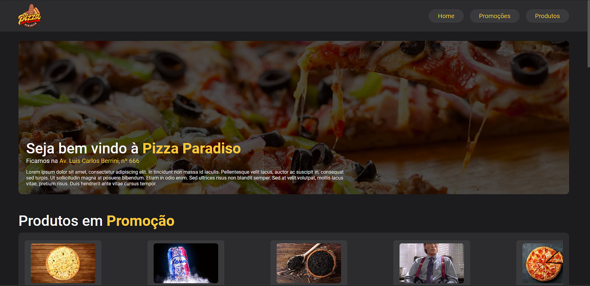
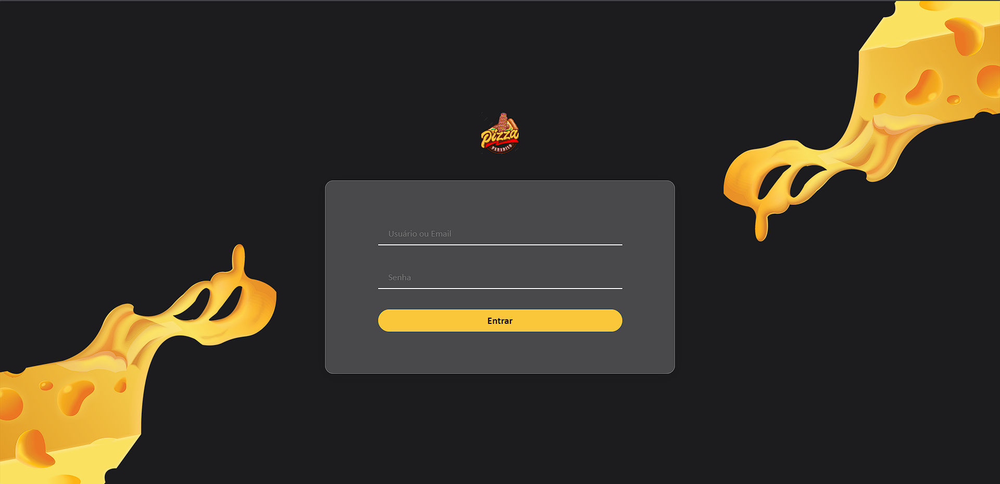
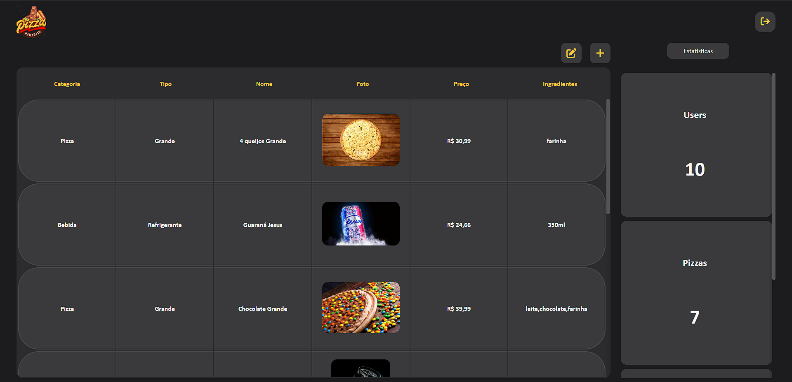
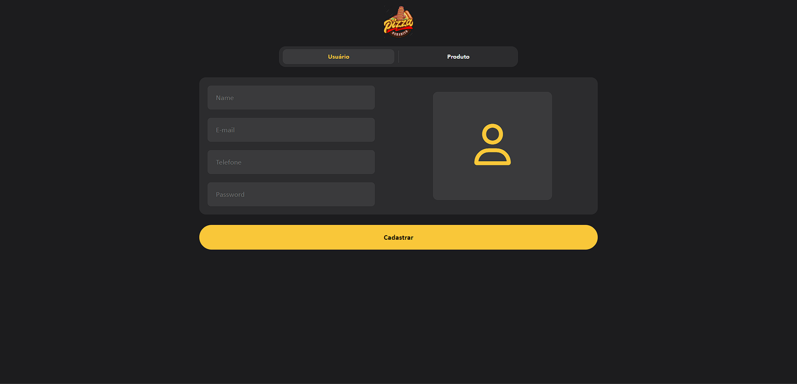

# FrontEnd

Projeto pizzaria - O projeto contêm telas para o consumo dos produtos para que os clientes tenham acesso e um painel administrativo para o gerenciamento e cadastro de novos produtos!

## Fotos do Projeto!

### Home
</img>

----

### Login
</img>

----

### Dashboard
</img>

----

### Cadastros
</img> </img>

## Referência

- [Website](pedrovs3.github.io/pizzaria-front/)
- [Website Admin](pedrovs3.github.io/pizzaria-front/admin)
- [Figma](https://www.figma.com/file/VWaoyiT3EjzyMt1EzK00PO/Pizzaria-2-semestre?node-id=0%3A1&t=ejfS0cAndB0iSs9Z-1)

# Funcionalidades

## CMS
- Cadastro de novos produtos
- Login
- Cadastro de novos Funcionarios
## Client
-  Listagem
-   Curtida em produtos
- Filtros para aprimorar busca
- Form para envio de criticas/sugestões

## Stack utilizada

SweetAlert, Axios, Figma
