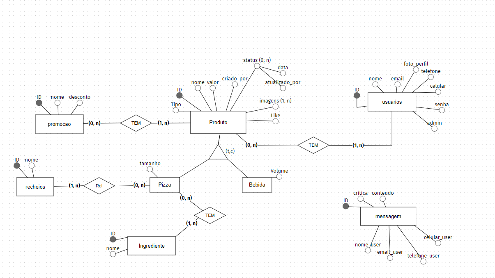
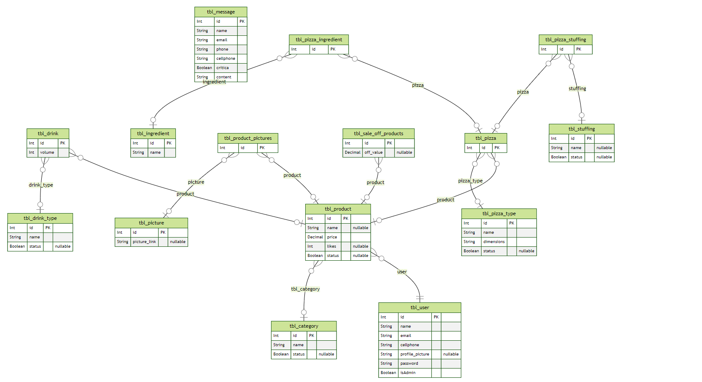

# BackEnd & Database

Projeto pizzaria - O projeto contêm duas API's que dividem o mesmo banco, porém uma é administrativa com acessos aos POST, DELETE  e UPDATE, e a outra é para o consumo dos produtos pelo client tem acesso retristo as rotas de POST, UPDATE e GET

## Database
O banco foi projeto para tentar suportar novas funcionalidades que o backend pode agregar com o tempo.

## Modelo Conceitual

## Modelo Logico

# API's
O projeto foi partido em duas API's uma para o client a qual não necessita de JWT, e o CMS que é necessario a autenticação via JWT.

## CMS
- Cadastro de novos produtos
- Login
- Cadastro de novos Funcionarios
- Cadastro de novos Produtos
- Autorização com JWT
- [API LINK](https://pizza-cms-api.netlify.app/.netlify/functions/server/user/count)
## Client
-  Listagem
-  Curtida em produtos
-  Filtros para aprimorar busca
- Form para envio de criticas/sugestões
- [API LINK](https://api-pizza-client.netlify.app/.netlify/functions/server/product)

### EndPoints
- [Documentação CMS](https://app.swaggerhub.com/apis/Guilherme-Joviniano/api-cms/1.0.0)
- [Documentação Client](https://app.swaggerhub.com/apis/Guilherme-Joviniano/api-client/1.0.0    )

## Stack utilizada

  
  Fastify  
 Prisma  
  

 

 

